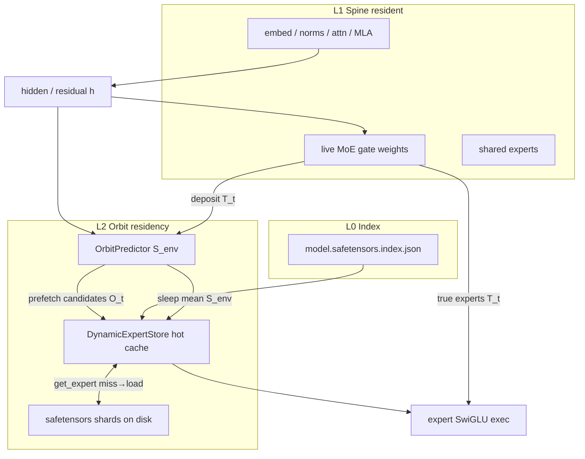

# Architecture (Object A) — what to analyze

This document is for readers who open the repo and need a **map of moving parts**, not a marketing page.

## System diagram



## Cycle (one token)

1. **Predict** `OrbitPredictor.predict(h, tok_id)` → candidate expert ids.  
2. **Prefetch** async load into `DynamicExpertStore` (and runtime pack cache).  
3. **Exec** live DeepSeek gate → true set \(T_t\); compute hot ∪ sync-miss.  
4. **Deposit** `OrbitPredictor.deposit(h, T_t, tok_id)`.  
5. **Sleep** `evict_below_mean` / byte trim.

Live gate ≠ OrbitPredictor. Analyze **both** if you instrument the full runtime.

## Where the analyzable signal lives

| Signal | File | How to get it |
|---|---|---|
| Hit curve orbit vs baselines | `analysis/data/orbit_trajectory_200.json` | `generate_orbit_trajectory.py` |
| Plots | `analysis/figures/*.png` | `plot_orbit_analysis.py` |
| Formulas | `docs/MATH.md` | read / re-derive |
| Expert slice residency | `examples/02_*`, `03_*` | run with HF cache |
| Full generate stats | `SparseDeepseekRuntime.stats()` | `n_modeled_*`, `gate_miss_seconds`, resident |
| Lab HumanEval JSON | `results/v36_humaneval_orbit_results.json` | offline |

## Module dependency

```text
emergent_metrics
    ↑
orbit_predictor
    ↑
sparse_moe_runtime ──→ dynamic_expert_store
    ↑
deepseek_chat_engine
```

## What this repo is *for* analytically

- Study **online field** \(S_{\mathrm{env}}\) under regime shifts (synthetic 200-step stream).  
- Compare **prefetch predictor** to prev_copy / frequency / cyclic with emergent wins>losses.  
- Inspect **expert slice I/O** without loading the full MoE.  
- Optionally profile **miss-wait** on real DeepSeek-V2-Lite (long, hardware-bound).

## What it is *not*

- Not a chat-memory / RLM paper dump (Object B).  
- Not a claim that OrbitPredictor is DeepSeek’s trained router.
